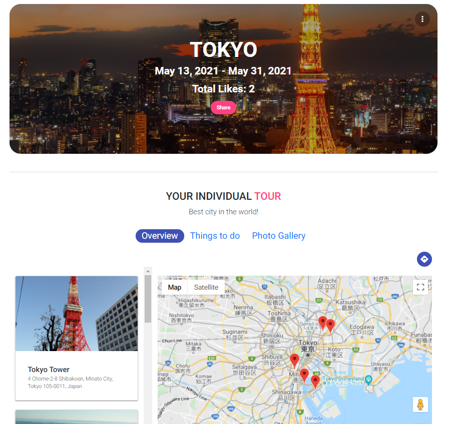
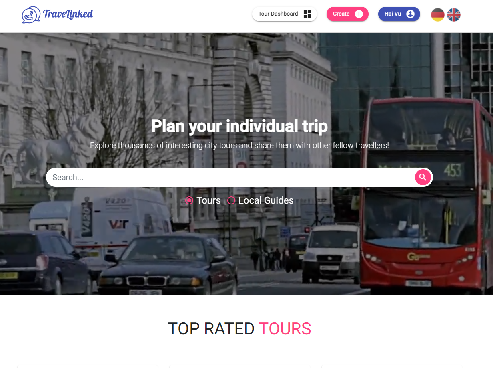

# TraveLinked

TraveLinked is a web application for individual trip planning with a focus on social interactions. With a personal user account, you can create your own tours and share them with other users. These tours can be rated by other travelers. Due to the great networking within the community, one has the possibility to act as a local guide to recommend insider tips to other users.

Used Technologies:
- Database: MongoDB
- Frontend: Angular
- Backend: Node.js, Express.js
(MEAN Stack)
- Project management: JIRA

TraveLinked ist eine Webanwendung für die individuelle Reiseplanung mit Fokus auf soziale Interaktionen. Mit einem persönlichen Benutzeraccount, kann man eigene Touren anlegen und diese mit anderen Benutzern teilen. Diese Touren können von anderen Reisenden bewertet werden. Durch die große Vernetzung innerhalb der Community, hat man die Möglichkeit als Local Guide zu agieren, um anderen Benutzern Geheimtipps zu empfehlen!

### Impressionen

